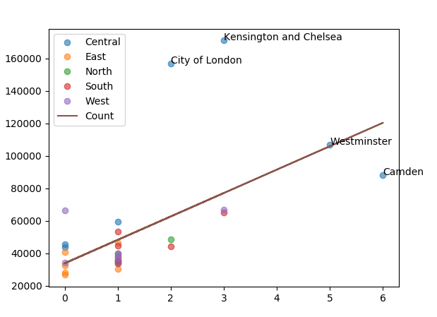

# Bookstore_income_project

This is a data science project, finding out if there is a correlation between income and Waterstones bookstores in London.


Blog posts on website documenting me developing the project:

[Part 1, ](https://www.tobiolabode.com/blog/2020/4/21/bookstores-vs-income-data-science-project-part-1)
[Part 2, ](https://www.tobiolabode.com/blog/2020/4/26/bookstore-vs-income-part-2)
[Part 3, ](https://www.tobiolabode.com/blog/2020/5/4/bookstores-vs-income-part-3)
[Part 4, ](https://www.tobiolabode.com/blog/2020/5/11/bookstores-vs-income-part-4)
[Part 5](https://www.tobiolabode.com/blog/2020/5/15/bookstores-vs-income-part-5)

## Tasks to complete:
[] add comments describing code  in analysis.py


## Perquisites
For the Web scraper function:
- Selenium
- Requests


For the data analysis:
- Pandas
- numpy
- scipy
- matplotlib

## Installation

Use Git Clone to install project

```bash
git clone https://github.com/tobiolabode/Bookstore_income_project.git
```

## Usage
To run the data analysis:

```python

python main.py
```

If you want to use the data scraper functions:
```python

python scraper.py
python borough.scraper.py

```

## Contributing
Pull requests are welcome. For major changes, please open an issue first to discuss what you would like to change.
